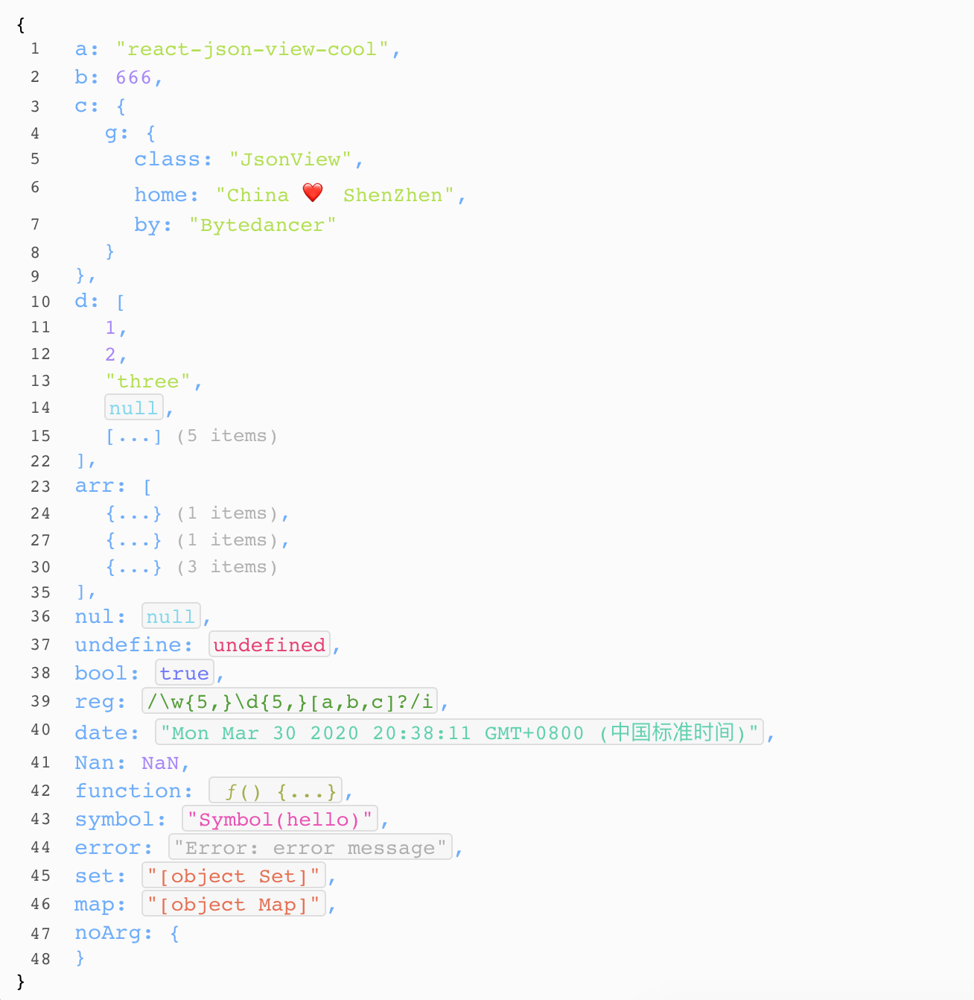

# react-json-viewer

React json view plugin, supports expansion and hiding.use react hooks.

[](https://github.com/5SSS/react-json-viewer)

## Links

- [Github](https://github.com/5SSS/react-json-viewer)

## Install

```js
npm install --save react-json-viewer-cool
```

## Usage

```jsx
import ReactJsonViewer from 'react-json-viewer-cool';

const data = {
  number: 1,
  string: 'hello',
  array: [1, 2, 3, 4],
  object: {
    key: 'oops!'
  },
  bool: true,
  null: null,
  undefined: undefined,
  function: () => {},
  error: new Error('e..'),
  regExp: /\w/g,
  date: new Date(),
  symbol: Symbol('a'),
  map: new Map(),
  set: new Set(),
  any_thing: '...'
};
function App() {
  return <ReactJsonViewer data={data} />;
}
ReactDOM.render(<App />, document.getElementById('root'));
```

## Example



## Props

| Attribute | Type | Default |
| --------- | ---- | ------- |
| data      | any  | no      |

## Events

not yet...

## PS

如果喜欢请给个星星，谢谢。
If you like, please give me a star, thank you.

如果需要帮助: QQ:1573815240 邮箱: 1573815240@qq.com
if you need help: QQ:1573815240 email: 1573815240@qq.com
